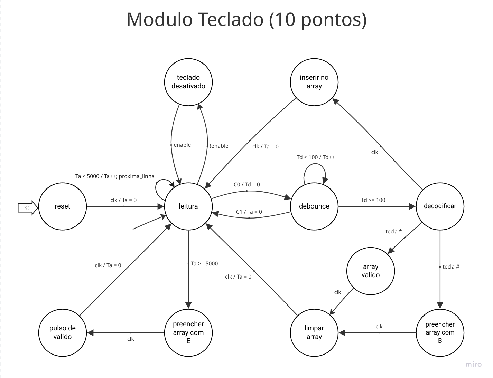

# Módulo Teclado

## Especificação

Módulo responsável por lidar com o teclado matricial, configurando sua leitura, realizando debounce para evitar ruídos no sistema  e decodificar o resultado de forma interpretável ao sistema. O módulo entrega para seus consumidores um conjunto de 20 dígitos cujos valores são apresentados na tabela abaixo (código BCD). Sempre que o teclado decodificar o pressionar de uma tecla ele deve atualizar o barramento com o atual conjunto de dígitos, caso seja a tecla “*” o pino digitos_valid  deve ter seu valor como 1. Toda vez que esse processo for realizado, o barramento digitos_value deve ser completado com o valor “0xF” em todo o barramento, indicando não haver dígitos ali.

Tecla Pressionada | Valor
-|-
0 | 0x0
1 | 0x1
2 | 0x2
3 | 0x3
4 | 0x4
5 | 0x5
6 | 0x6
7 | 0x7
8 | 0x8
9 | 0x9
\* | 0xA
\# | 0xB


Caso o usuário não digite as 20 teclas, ou seja não complete todo o array de dígitos, os dígitos faltantes devem ser completados com o valor “0xF”. Exemplo:

```text
Foi digitado: 12345678 + *
ARRAY: [ FFFFFFFFFFFF12345678 ]
```

A cada nova tecla digitada o usuário possui até 5 segundos para inserir uma nova tecla, ou confirmar com o “*”, caso contrário o barramento digito_value deve ser preenchido com o valor “0xE” e pino de saída digitos_valid deve ter seu nível lógico em 1. Após um pulso seu sinal deve ser derrubado para 0 e então o barramento digito_value deve ter seu valor preenchido por “0xF”.

A tecla “#” possui um comportamento especial, uma vez que o teclado decodifique tal tecla, ele preencherá o barramento com o valor “0xB” e o pino de saída digitos_valid deverá ter seu nível lógico em 1 por um pulso de clock. Após tal pulso o barramento digitos_value deverá ser preenchido pelo valor “0xF”

### Definição do teclado

```sv
module decodificador_de_teclado (
    input 	logic		clk,
    input	logic		rst,
    input	logic 		enable,
    input 	logic [3:0] col_matriz,
    output 	logic [3:0] lin_matriz,
    output 	senhaPac_t	digitos_value,
    output	logic 		digitos_valid
);

endmodule
```

Alguma tecla foi solta

### Entradas e Saídas do módulo

Nome | Tipo | Significado
-|-|-
enable | logic  | Informa ao módulo se ele deve estar lendo e tratando as teclas ou não.
col_matrix | logic[3:0] | Identificar a coluna
lin_matrix | logic[3:0] | Identificar a linha
digitos_value | senhaPac_t | Barramento de entrada com os últimos 20 dígitos do teclado, só deve ser lido quando ocorrer uma transição ascendente de digitos_valid.
digitos_valid | logic | Sinal para informar que os dados do teclado podem ser lidos, esse sinal é uma transição ascendente.
clk | logic | Clock do sistema
rst | logic | Reset do sistema

## Nossa Interpretação

### Máquina de Estados

Nessa máquina abstraímos as saídas para simplificar o diagrama e as transições (no formato `<condição> / <ação (opcional)>`) que ficará no always_ff, ou seja: mudança de estado e contadores.



#### Legenda dos contadores e ações

Nome | Descrição
-|-
`Ta` | Tempo de ausência, responsável por contar caso o usuário não digite nada por 5 segundos
`Td` | Tempo de debounce, 100 ms para evitar instabilidades do botão
`proxima_linha` | Atualiza `lin_matrix` para ler a próxima linha

#### Legenda das condições

Apelido | Condição | Descrição
-|-|-
C0 | `col_matrix == 'b0111 \|\| col_matrix == 'b1011 \|\| col_matrix == 'b1101 \|\| col_matrix == 'b1110`| Alguma tecla foi pressionada
C1 | `col_matrix == 'b1111` | Todas as teclas foram soltas
Tecla * | `col_matrix == 'b0111 && lin_matrix == 'b1110` (a ajustar) | A tecla pressionada foi "*"
Tecla # | `col_matrix == 'b1101 && lin_matrix == 'b1110` (a ajustar) | A tecla pressionada foi "#"

### Saídas

* `lin_matriz` começa como `'b0111` e a cada `proxima_linha` vai mudando a posição do 0 `'b1011` -> `'b1101` -> `'b1110` -> `'b0111` -> etc
* `digitos_valid` só será `1` nos estados `array_valido`, `preencher_array_com_B` e `preencher_array_com_E`
* `digitos_value` no
  * nos estados `reset` e `limpar_array` é definido com tudo `'hF`
  * no estado `preencher_array_com_E` é definido como tudo `'hE`
  * no estado `preencher_array_com_B` é definido como tudo `'hB`
  * no estado `inserir_no_array` vai deslocar 4 bits para esquerda e inserir valor decodificado em `decodificar`
